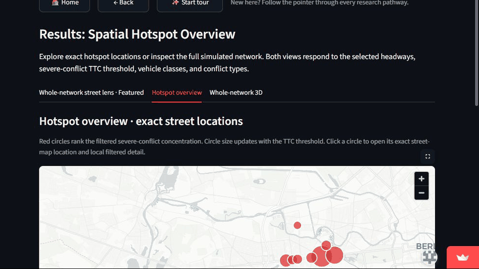

# Hotspots and 3D Network Views

Mobility Safety Intelligence converts prepared conflict-point outputs into ranked spatial concentrations and interactive 3D landscapes.

## What it demonstrates

- Standardised Gaussian kernel-density estimation for hotspot exploration.
- Ranked local peaks rather than arbitrary visual selection.
- Clickable hotspot summaries that respond to headway and TTC settings.
- Local and whole-network 3D views with controllable camera orientation.
- Street-context layers that help users see what lies beneath the 3D bars.

The views communicate where simulated conflicts concentrate. They are analytical lenses over prepared SUMO outputs, not live surveillance or operational crash predictions.

[Open Mobility Safety Intelligence](https://mobility-safety-intelligence.streamlit.app/) · [View the implementation repository](https://github.com/amirhosseintaheri93-collab/mobility-safety-intelligence)
